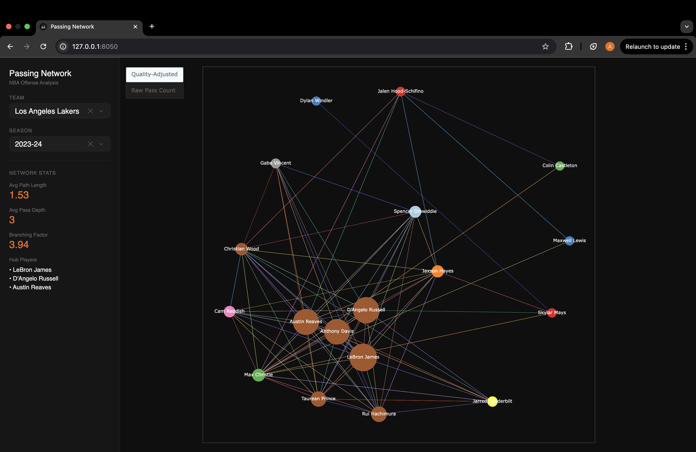

# NBA Passing Networks

An interactive tool for visualizing NBA team offense as weighted passing networks. Select any team and season to explore how the ball moves, which players are central to the offense, and how possessions are structured.



## Overview

Each player on the team is represented as a node, and each directed edge represents passes between two players. Edge weight is a quality-adjusted pass score (passes + assists), so edges reflect not just volume but also efficiency. Node size scales with each player's centrality score — the more central a player is to the team's offensive flow, the larger their node appears.

Node colors represent passing clusters — groups of players who frequently pass to each other, discovered by filtering edges above a weight threshold and running BFS to find connected components.

## Features

- **Quality-Adjusted vs Raw Pass Count** toggle to switch between weighted and raw edge views
- **Weighted centrality scoring** — normalised sum of incoming and outgoing edge weights per player
- **Cluster detection** — BFS-based connected component analysis on a filtered graph
- **Possession trees** — approximate pass sequences built from play-by-play data, used to compute average pass depth and branching factor
- **Sidebar stats** — avg path length, avg pass depth, branching factor, and top hub players
- **CSV caching** — API data is cached locally on first load so subsequent loads are instant

## How It Works

### Passing Graph

Passing data is fetched from the NBA API's `PlayerDashPtPass` endpoint for every player on the roster. Each player-to-player passing relationship becomes a directed edge with weight `PASS + AST`. Only relationships with at least 10 passes are included to filter noise.

### Centrality

Each player's centrality score is the sum of all their incoming and outgoing edge weights, normalized so the highest-scoring player has a score of 1.0. This captures both how often a player receives the ball and how often they distribute it.

### Clusters

Edges below a weight threshold of 200 are removed, and BFS is run from each unvisited node to find connected components. Players in the same component share a color.

### Possession Trees

Since the NBA's `PlayByPlayV3` endpoint doesn't record pass receivers, possession sequences are approximated by grouping players involved in each possession and randomly shuffling them into a sequence. Each sequence is inserted into a shared tree structure. Average depth and branching factor are computed across the first 5 games of the season.

> Note: The possession tree sequences are an approximation — the derived statistics are meaningful measures of possession complexity, but the specific pass orderings are not accurate.

## Setup

**Requirements:** Python 3.11+

```bash
git clone https://github.com/aaritdua/nba-passing-networks.git
cd nba-passing-networks
python -m venv venv
source venv/bin/activate
pip install -r requirements.txt
python main.py
```

Then open `http://127.0.0.1:8050` in your browser.

> First load for a new team/season may take up to 30 seconds while data is fetched from the NBA API. Subsequent loads are instant.

## Project Structure

```
src/
    graph.py          # WeightedDirectedGraph implementation
    tree.py           # PossessionTree implementation
    algorithms.py     # Centrality, clustering, path length, possession stats
    data_loader.py    # NBA API fetching and CSV caching
    figures.py        # Plotly figure construction
    layout.py         # Dash app and sidebar layout
    callbacks.py      # Dash callbacks
    visualization.py  # App entry point
    assets/
        custom.css    # Dark mode dropdown styling
main.py
requirements.txt
```

## Tech Stack

- [Dash](https://dash.plotly.com/) — web framework
- [Plotly](https://plotly.com/python/) — interactive graph visualization
- [nba_api](https://github.com/swar/nba_api) — NBA stats data
- [NetworkX](https://networkx.org/) — graph layout
- [pandas](https://pandas.pydata.org/) — data processing